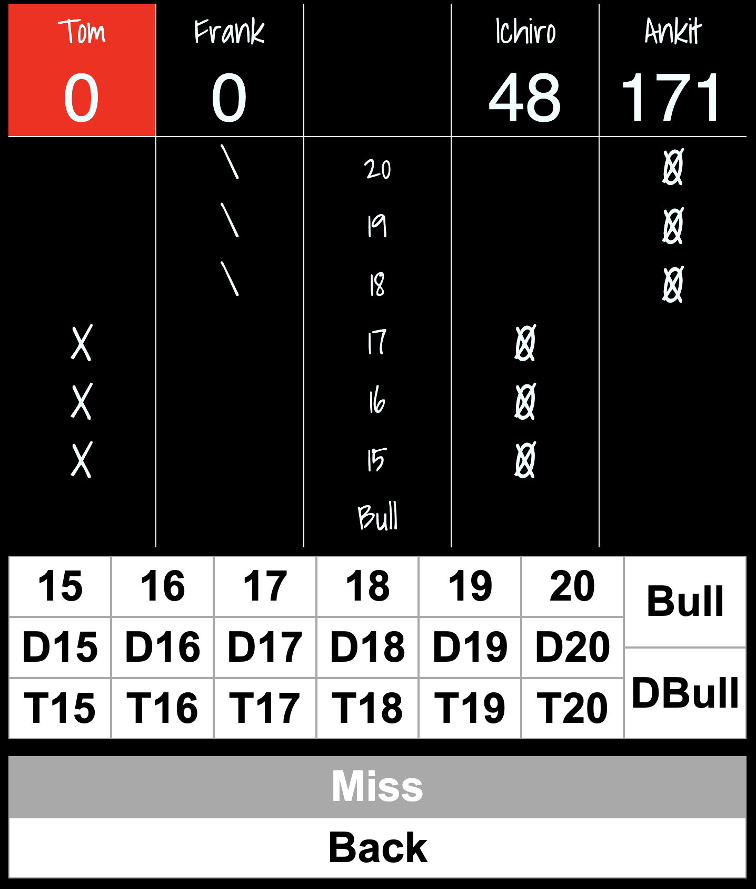

# darts

This is an experiment with using [zustand](https://zustand-demo.pmnd.rs/) and [parcel](https://parceljs.org/) for app development. It's also meant to be a platform independent way to track dart games on whatever device you have handy.

See: https://pausebreak.github.io/darts/ for a live demonstration.

# Current Progress

- heavily using `zustand` subscribers
- sounds are in place including saying the next player's name if the browser supports `speechSynthesis`
- game logic has 100% test coverage

# Things Need Done

in somewhat of an order:

- react tests ( held off on these until the interface settled )
- stats
- add technical cricket variant
- color pallette
- visual design

# Evaluation

If you are going to use hooks then zustand + immer is wonderful to work with.

Parcel has for the most part just worked as advertized. So far the project has not thrown anything hard at it though. For instance the css is just plain css.
